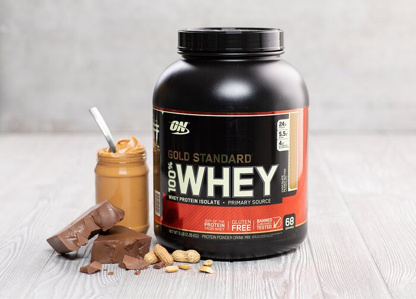

# How to Choose The Best Protein Powder?

**Protein is essential for building and maintaining muscle mass. The best approach is to ingest protein from whole foods. However, many of us struggle to hit our daily protein goals and here where protein powder supplements come in handy.** 

Protein powders are supplements made by extracting protein from a natural source like milk and a very famous one is whey protein. Whey is the liquid form leftover from curdling of milk.

## 1. Whey Protein Concentrate

Whey protein concentrate is the cheapest protein powder with good protein content. However, it has the highest amount of lactose (sugar found in milk) and those who are not able to digest daily product properly may find whey protein concentrate (WPC) not suitable as a protein supplement. These individuals can use Whey Protein Isolate instead (WPI).

## 2. Whey Protein Isolate

Whey Protein Isolate (WPI) is produced by removing the sugars in the milk (lactose) which results in a higher proportion of protein due to the removal of lactose. This can probably reduce gastrointestinal distress that is cause by Whey Protein Concentrate, so WPI is more suitable for lactose intolerant individuals. Those who are only lactose sensitive can probably use WPC/WPI blends.

## 3. Whey Protein Hydrolysate

Whey Protein Hydrolysate (WPH) has been further refined using digestive enzymes to facilitate easy digestion for those who find difficulty digesting Whey Protein Isolate or concentrate. If you tried WPC or WPI and have digestive issues, then Whey protein hydrolysate (WPH) will probably cause no problem since it has already been digested by the digestive enzymes. However, it is more expensive and probably does not taste as good.

## 4. Soy Protein

If you are vegan and looking for a complete source of protein powder, you can supplement with Soy Protein Powder. Soy protein powder supplements can help and are complete source of protein which is which means they contain all of the nine essential amino acids that the body cannot make on its own. This can be difficult sometimes for vegans to ingest all nine essential amino acid from vegan sources alone unless they mix different plant sources to hit their needs from nine essential amino acids. Supplementing can also really help with hitting your protein goal.